# CAMS API Documentation: Streamlining Capstone Project Management for the Computer Science Department at UMass Boston

# CAMS API Documentation Overview:

The CAMS API (Capstone Project Management System) documentation outlines a set of endpoints designed to facilitate the efficient assignment and supervision of capstone projects for students within the Computer Science Department at the University of Massachusetts, Boston.

This professionally crafted web application, developed using the MERN stack, aims to streamline the capstone project management process specifically for Professor Kenneth Fletcher and other educators within the institution.

## Original Development Team:

    1. Rakshith Reddy M
    2. Bapi Raju K
    3. Chandana

## Subsequent Development Team:
    1. Vidhya
    2. Qudseen
    3. Vishwa
    4. Sasank

## Guidance by:
    Professor [Dr.] Kenneth Fletcher

## Development History:
### 1. Initial Development (CS682 Software Development Laboratory):
        - Developed by Rakshith Reddy M, Bapi Raju K, and Chandana.

### 2. Further Development:
        - Vidhya, Qudseen, Vishwa, and Sasank contributed to additional development and enhancements.

## Acknowledgements:
    The development of the CAMS Portal was made possible through the guidance and support of Professor [Dr.] Kenneth Fletcher.

# Issues Identified and addressed in the second phase of development:

## Issues 

### Project Allocation leads to non-functional tab
##### Before:
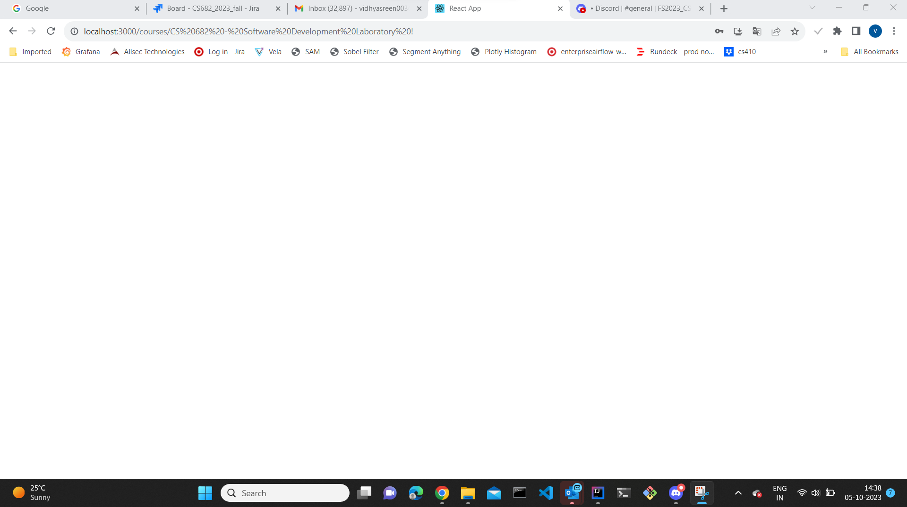

##### After:

\
Now project allocation redirects the page to assign projects styled papaer as expected. In that page using the preferences set by students for the projects published  in that course, the projects are assigned to the students

\
In <strong>CoursePage</strong>, the <strong>setComponent</strong> function is used to update the component state based on user interactions. The component state determines which part of the UI is rendered on the page.

\
 **useState(1)** initializes the **component** state with the value 1. This means that by default, the **CoursesStudents** component (corresponding to component value 1) will be rendered when the page loads.

\

\
Three clickable elements representing different sections: **Student Management**, **Project Management**, and **Project Allocation**. Each element has an __onClick__ event handler that calls the __setComponent__ function with a specific value when clicked.

* When "Student Management" is clicked **(onClick={() => setComponent(1)})**, it sets the component **state** to 1.
* When "Project Management" is clicked **(onClick={() => setComponent(2)})**, it sets the component **state** to 2.
* When "Project Allocation" is clicked **(onClick={() => setComponent(3)})**, it sets the component **state** to 3.

\
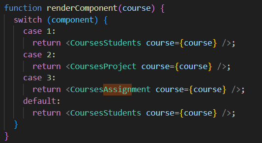

\
The value passed to **setComponent** determines which section should be rendered, and the **renderComponent** function uses this state value to conditionally render the appropriate component (**CoursesStudents**, **CoursesProject**, or **CoursesAssignment**). The **component** state is then updated accordingly whenever the user clicks on one of the section buttons.

### Dahboard is empty

##### Before:
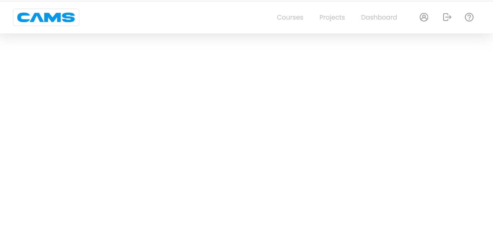

##### After:
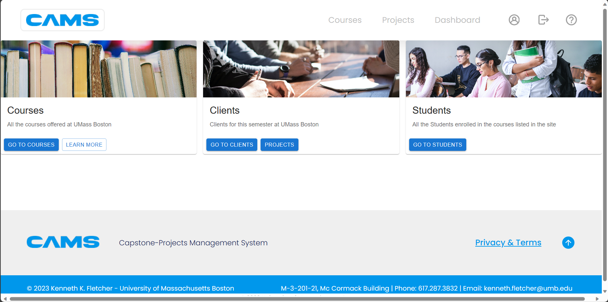

\
The **Admin dashboard** allows the admin to navigate to and between **Students**, **Courses**, **Clients** and **Projects**. And admin can access his profile through admin dashboard also can manage students, clients and projects.

\

\

\

##### Card Creation:
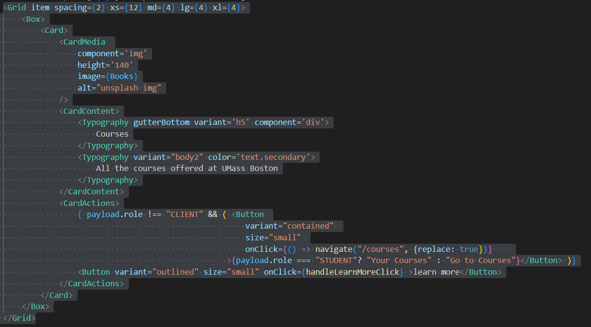

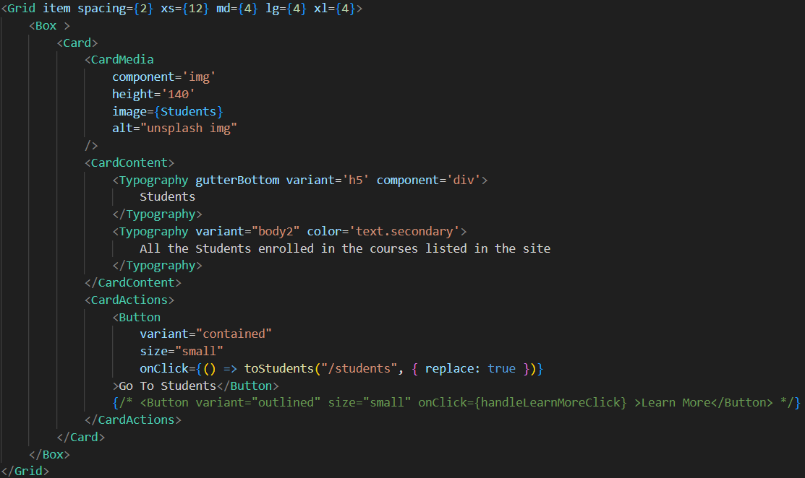

\
In this code snippet:

* Three cards for Courses, Clients, and Students are created using Material-UI's Card components.
* Each card has a CardMedia component to display an image, a CardContent component for the content, and CardActions for buttons.
* The buttons include actions such as navigating to specific pages (/courses, /pages, /students) and triggering functions (handleLearnMoreClick).

##### Redirection:

\
In this code snippet:

* The useNavigate hook is used to obtain the navigate function for programmatic navigation.
* Event handlers like handleLogout, handleLearnMoreClick, and handleLearnMoreClientsAndProjectsClick use the navigate function to redirect users to different pages when buttons are clicked.
* The combination of card creation and navigation event handlers provides a visually appealing dashboard with clickable sections that redirect the user to specific pages or trigger relevant actions.

### Students Page
##### Before:
    Null
##### After:

##### Import Statements:
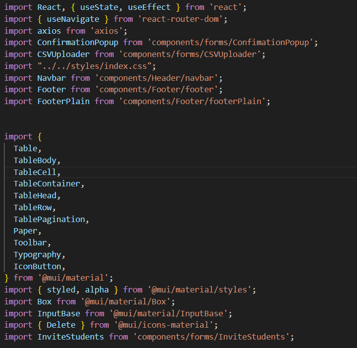

\
These are import statements for various React and Material-UI components, as well as custom components (**ConfirmationPopup**, **CSVUploader**, **Navbar**, **Footer**, and **FooterPlain**). It also imports styling-related components from Material-UI.

##### Styled Components:
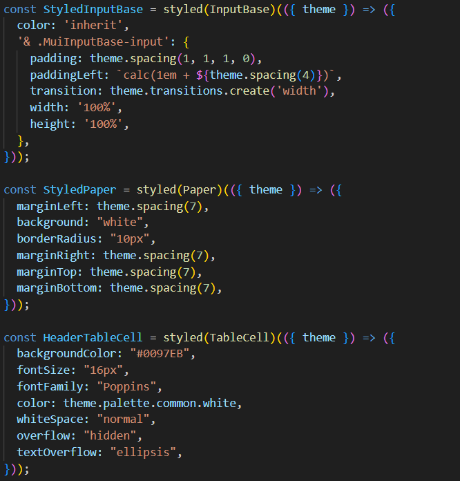
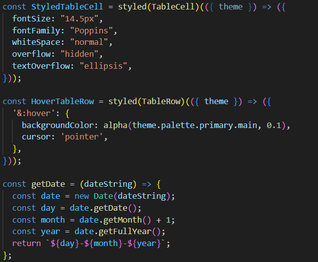

\
These are styled components using the styled utility from Material-UI. They define the styling for various elements such as **InputBase**, **Paper**, **TableCell**, and **TableRow**

##### Functional Component:
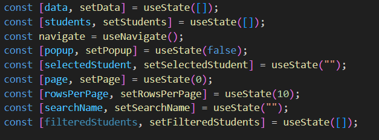

\
This is the main functional component named **Studentdata**. It uses React hooks (**useState**, **useEffect**) to manage state variables.

##### Event Handlers:
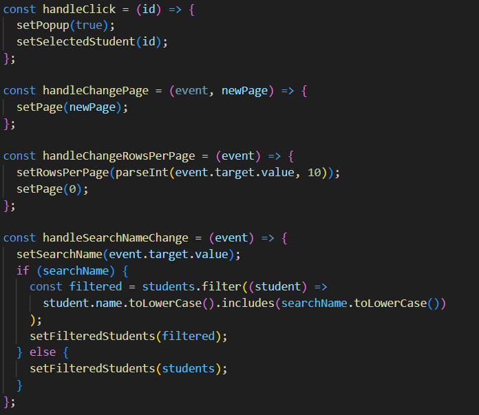

\
These functions handle various events such as clicking on a table row, changing the page, changing rows per page, and changing the search name.

##### useEffect for Fetching Data:
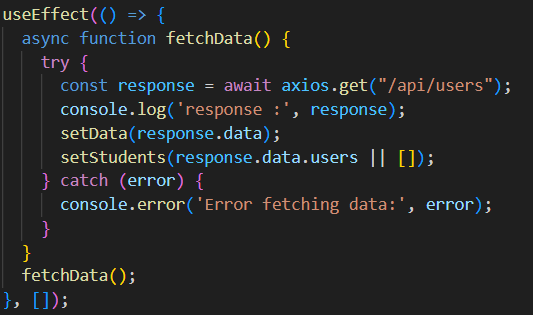

\
The **useEffect** hook is used to fetch data from the server when the component mounts.

##### Delete User Function:
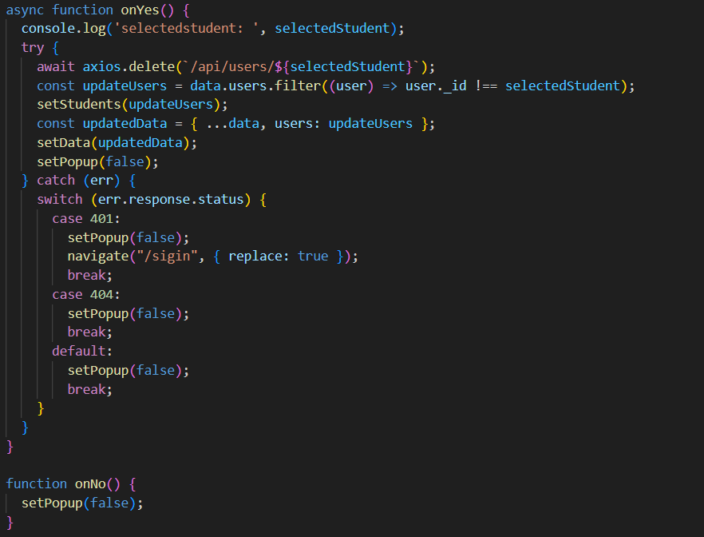

\
These functions handle the deletion of a user when the confirmation popup is confirmed or denied.

##### Render JSX:
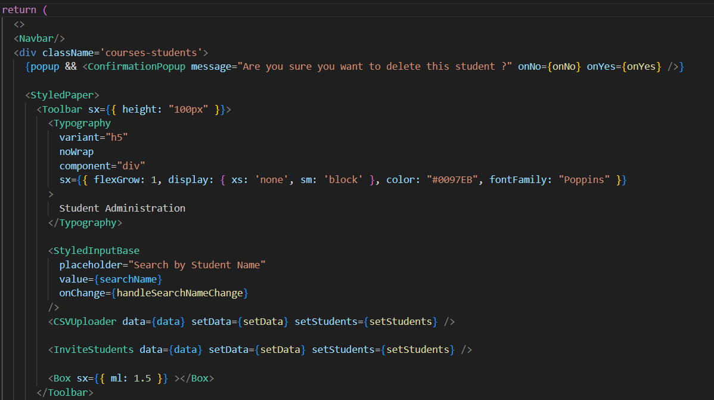

\
The **return** statement renders the JSX structure of the component. It includes a **Navbar**, a main content section (**courses-students**), and a **Footer**.

##### Table and Pagination:
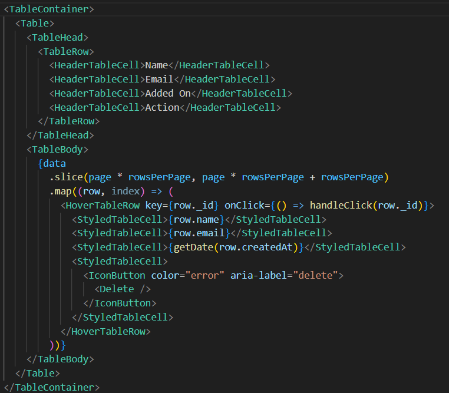
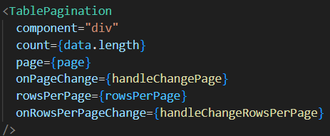

\
This section includes a **Toolbar** for search and actions, a **TableContainer** for displaying user data, and **TablePagination** for handling pagination.

##### TableRow and TableCell:
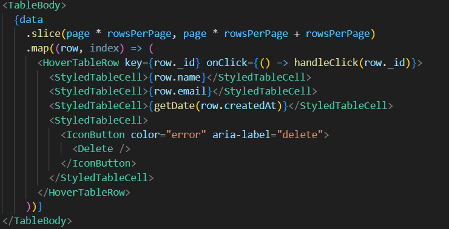

\
This maps over the user data to create **TableRow** components with **TableCell** components for each user's details.

\
Overall, this component fetches user data, displays it in a table, allows searching, and provides options for deleting users. It also includes styling and uses Material-UI components for a consistent design.

